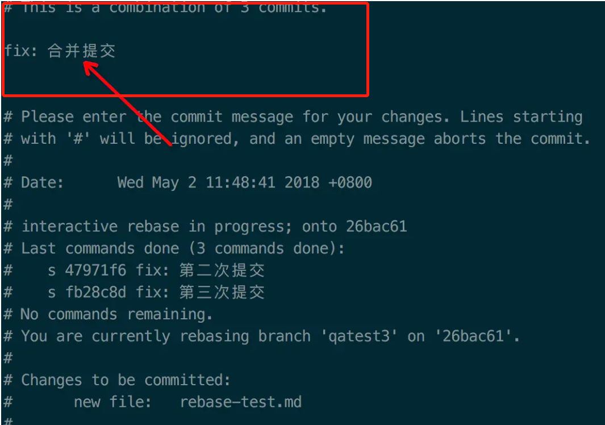

# Git-Better-Use

## 一、合并 commit 记录
1. `git rebase -i [startpoint]  [endpoint]` : 合并 startpoint 到  endpoint 之间的 commit log
   - i 的意思是 --interactive, 即弹出交互式的界面让用户编辑完成合并操作
   - startpoint: 开始的commit-id，合并的时候不包含此记录
   - endpoint：如果不指定，则该区间的终点默认是当前分支HEAD所指向的commit
2. 此时会进入 vim 的交互界面：按 `i` 切换到编辑模式
3. 使用 Squash 策略进行合并：第一个为 p，其余为 s
```
p  ... ... 
s  ... ... 
s  ... ... 
s  ... ... 

```
5. 按 `Esc` 切换到底线命令模式
6. 按 `:wq` 保存并退出
6. 此时会进入 commit message 的编辑界面
7. 按 `i` 切换到编辑模式
8. 将之前的 commit message 修改成合并后的新的  commit message
   
9.  按 `Esc` 切换到底线命令模式
10. 按 `:wq` 保存并退出
11. `git push -f origin`：强制推送到远程

## 二、合并指定 commit
1. 定义：不合并一个分支所有的 commit, 只合并想要的 commit
2. 方法: `git cherry-pic <commit-id>`


## 三、git reset Vs git revert
1. git reset: `git reset <commit-id>`: 将提交记录回退到指定的 commit-id 上
2. git revert: `git revert <commit-id>`: 新建一条 commit, 撤回之前 commit-id 的修改
> 对于个人的 feature 分支而言，可以使用 git reset 来回退历史记录，之后使用 git push --force 进行推送到远程，但是如果是在多人协作的集成分支上，不推荐直接使用 git reset 命令，而是使用更加安全的 git revert 命令进行撤回提交。这样，提交的历史记录不会被抹去，可以安全的进行撤回。

## 四、git stash 暂存文件
1. `git stash save <message>`: 在暂存文件的时候，添加暂存备注
2. `git stash list`: 查看所有 stash
3. `git stash apply <num>`: 恢复第 num 个暂存，不会把 stash 记录从 stash list 中删除
4. `git stash pop`: 恢复最近一次的 stash, 并把这条 stash 记录从 stash list 中删除
5. `git stash clear`: 删除 stash list 里所有的 stash 记录

## 五、撤销修改
1. `git checkout <filename>`: 撤销某个文件的修改
2. `git checkout <file>`: 撤销整个文件夹的修改
3. `git reset <filename> || <file>`: 撤销暂存区(已经 git add)的修改

## 六、使用 git alias 对 git 指令进行别名配置
1. `git config --global alias.<简化的字符> <原始命令>`
1. `vim ~/.gitconfig`: 查看全局的 git 配置
```
git config --global alias.ad add

// 我的配置
ad = add
ci = commit
pl = pull
co = checkout
me = merge
br = branch
st = status
```
